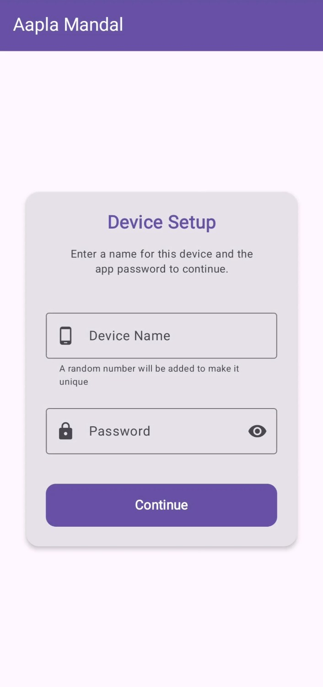
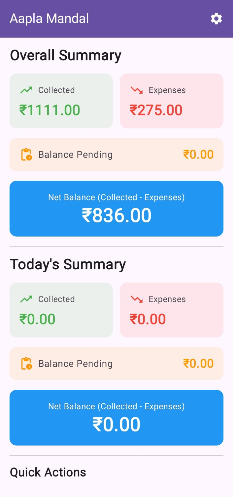
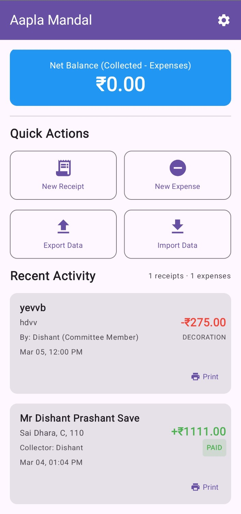
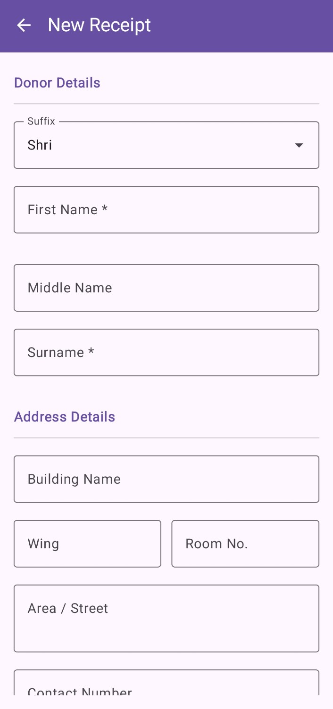
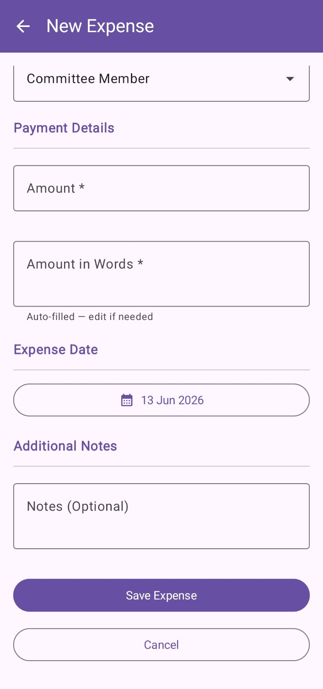
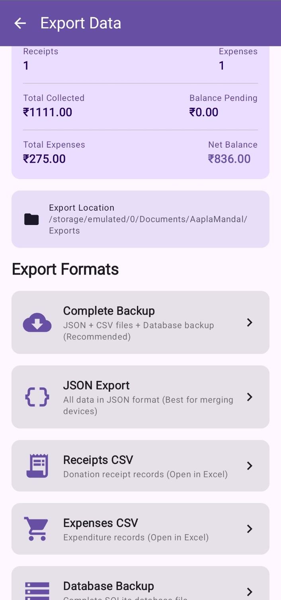
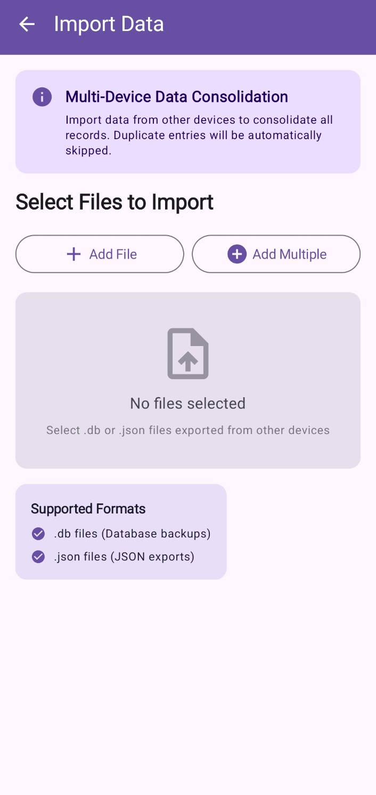
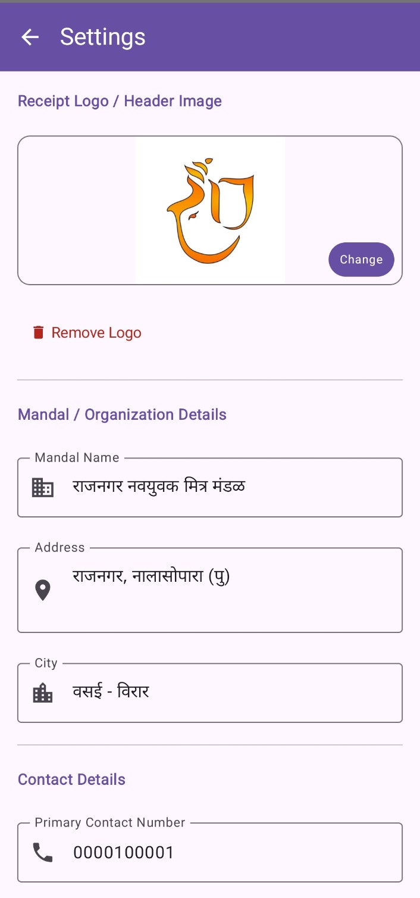

# Aapla Mandal (आपला मंडळ) 🌺

A highly efficient, cost-effective, and fully autonomous mobile application designed specifically for **Ganesh Festival Mandals** to manage incoming donations, track expenses, and issue real-time physical receipts.

This application is a **proven, real-world implementation** currently deployed and actively used by Mandals to streamline their festival auditing, financial management, and volunteer operations.

---

## 🚀 Key Architectural Highlight: 100% Serverless & Cost-Free
A primary requirement from the client was to eliminate recurring infrastructure costs (hosting, cloud databases, API gateways). To achieve this, **Aapla Mandal** is engineered as a completely **Server-Free and External Database-Free application**.

* **Local Storage Architecture:** The application utilizes a secure, robust local database embedded directly within the device.
* **Zero Upkeep Cost:** No monthly server bills, no hosting dependencies, and complete operational readiness even in areas with poor or zero internet connectivity (highly common during crowded festival pandals).
* **Data Portability (Central Optimization):** To prevent data silos, the app features an advanced **Import/Export system** allowing individual operational devices to export their transactional data and merge it at a central location for comprehensive final auditing.

---

## ✨ Features & Capabilities

* **Centralized Secure Access:** Simplified credential management tailored for multi-volunteer environments.
* **Real-time Financial Summary:** Dynamic dashboard showing real-time Collections, Expenses, and Net Balance.
* **Physical Receipt Printing:** Seamless integration with portable Bluetooth/Thermal printers to provide payees with instantaneous physical paper receipts upon donation.
* **Passbook-Style Transaction Logs:** A comprehensive, chronological log of all actions that can be reviewed or printed on demand.
* **Multi-Format Data Portability:** Backup and aggregate data using structural `.db` files, structural `JSON`, or tabular `CSV`.

---

## 📸 Interface & Application Walkthrough

The application's interface is designed for rapid high-volume data entry, optimized for volunteers operating in fast-paced environments.

### 1. Authentication & Security
To keep application access highly centralized yet straightforward for shifting volunteer shifts, the system implements a unified access credential configuration.

  

### 2. Live Dashboard Summary
Displays a real-time high-level financial overview of the Mandal's financial health, tracking total incoming collections, outgoing expenses, and the current net balance.

  

### 3. Core Action Center & Passbook
The central hub of the application. It provides immediate shortcuts to vital features (Receipts, Expenses, Data Portability) alongside a running, scrollable transaction log modeled after a traditional bank passbook. This log can be printed out in real time.

  

### 4. Incoming Collection / New Receipt Window
Intuitive form layout to record incoming festival donations, V वर्गणी (subscriptions), and sponsors. Upon submission, it fires a direct command to the connected thermal printer for a real-time receipt generation.

  

### 5. Outgoing Expense Tracker
Allows immediate recording of festival-related expenditures (decoration, sound, inventory, logistics, food distribution) to ensure the net balance remains perfectly audited minute-by-minute.

  

### 6. Data Export (Centralization Engine)
Enables users to export local data into multiple portable formats. Mandals can extract structural `.db` files, raw `JSON` arrays, or standard spreadsheet-ready `CSV` formats.

  

### 7. Data Import & Aggregation
Facilitates seamless backup restoration or multi-device data aggregation by accepting previously exported structural `.db` or `JSON` database states.

  

### 8. System Configurations
A clean settings interface to manage device-level parameters, configure printing preferences, and adjust local operational parameters.

  

---

## 🛠️ Data Synchronization & Central Auditing Flow

Because the application operates entirely offline without a centralized cloud server, multi-device setups follow a simple aggregation workflow:

1. **Deployment:** Multiple volunteers install the application on separate devices at different entry gates or collection tables.
2. **Collection:** Each volunteer works independently, recording transactions and printing receipts locally.
3. **Extraction:** At the end of the day or festival, each device uses the **Export Page** to dump a `.db` or `JSON` data snapshot.
4. **Consolidation:** The Head Auditor imports these snapshots into a single master device using the **Import Page** to automatically merge logs, compiling a singular, flawless financial audit report for the entire Ganesh Festival.

---

## 📋 Requirements & Tech Stack
* **Target Environment:** Mobile Devices
* **Storage Engine:** Embedded SQLite / Local DB
* **Hardware Integration:** Bluetooth Thermal Printer SDK (ESC/POS command sets for real-time printing)
* **Internet Requirement:** 0% (Fully Offline)
